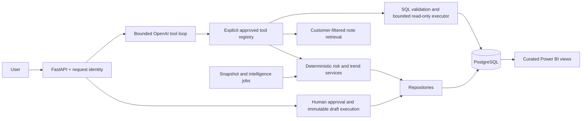

# Customer Intelligence Agent

A production-style portfolio application for customer-success teams: combine CRM facts, support metrics and qualitative notes to explain customer risk, detect deterioration, and propose human-approved follow-ups. All example customers and notes are synthetic.

## Architecture



The model interprets questions and synthesizes grounded explanations. Python owns customer facts, risk scores, historical deltas and action state. PostgreSQL stores customer data, snapshots, action audit records and intelligence events. OpenAI embeddings power semantic retrieval without a vector database; a clearly labeled offline mode supports local demonstrations and CI.

Implementation evidence is tracked in [BUILD_PLAN.md](BUILD_PLAN.md); engineering conventions are in [AGENTS.md](AGENTS.md). See the [architecture and trust boundaries](docs/architecture.md), [Azure runbook](docs/deployment-azure.md), [Power BI guide](docs/powerbi.md), and [interview walkthrough](docs/demo.md).

The [final build report](docs/BUILD_REPORT.md) records **120 passing tests, 95.54% source coverage**, evaluation results and the checks still requiring Docker or external services.

## What works

- 40 reproducible synthetic customers, 240 notes, validated CSV ingestion and PostgreSQL migrations.
- Typed customer API; authoritative risk scoring with explanations and testable dates.
- OpenAI Responses function calling with a strict tool allowlist; optional constrained analytical SQL.
- Customer-filtered embeddings and cosine retrieval; validated qualitative insights with source IDs.
- Persisted human approval, immutable payloads, atomic draft execution and append-only application audit records.
- JSON logs, request IDs, operational metrics, daily BI snapshots, historical trends and deduplicated intelligence events.
- Offline test/evaluation gates, non-root Docker image, Compose stack and Azure staging/CD assets.

This is a **production-style portfolio reference**, with tested controls and documented operational limits. It is not a deployed multi-tenant commercial service. All money is synthetic CAD MRR. The initial dataset totals **CAD 482,780 MRR**, with mean NPS **51.15** and **4.0** open tickets per account. These are fixture facts, not measured business outcomes.

## Technology

Python 3.12+, FastAPI, Pydantic, Psycopg 3, PostgreSQL 17/18, OpenAI Python SDK, NumPy, SQLGlot, pytest, Ruff, Docker/Compose, GitHub Actions, Azure Container Apps and Power BI Import mode. No LangChain, vector database, queue, Redis or Kubernetes. SQLGlot is a parser, not a database authorization control.

## Quick start: Docker

Prerequisites: Git, Python 3.12+ for configuration generation, and a running Docker engine with Compose v2.

```bash
git clone https://github.com/newtocode80/customer-intelligence-agent.git
cd customer-intelligence-agent
python scripts/configure_local.py
docker compose up --build
```

The configuration command creates an ignored `.env` with random local database passwords and **never overwrites an existing file**. No paid API key is needed in default `MODEL_MODE=demo`. In a second terminal:

```bash
python scripts/smoke_test.py
```

Open [interactive API documentation](http://localhost:8000/docs). Compose starts PostgreSQL, waits for database health, runs an owner-only initialization task, then starts the API under `cia_app`. API connections use Compose hostname `db`. PostgreSQL and API ports are bound only to loopback. Set `POSTGRES_PORT=5433` if local port 5432 is occupied. Database and embedding volumes survive restarts; `docker compose down` preserves them. Deleting volumes destroys saved approvals and history.

The container/Compose files are supplied and structurally checked; see the build report for which runtime checks were actually executed on the build machine. CI also starts Compose and runs smoke tests.

## Local Python setup

Create a virtual environment and activate it (`.venv/Scripts/Activate.ps1` on PowerShell, `source .venv/bin/activate` on bash):

```bash
python -m venv .venv
python -m pip install -r requirements-dev.txt -c constraints.txt
python scripts/configure_local.py
```

Create an empty database named `customer_intelligence` using your PostgreSQL administrator. Edit ignored `.env`: `ADMIN_DATABASE_URL` must contain that real local administrator connection; keep the generated `APP_DB_PASSWORD` and `ANALYST_DB_PASSWORD` consistent with the runtime URLs. Use URL-encoded passwords or Psycopg conninfo format when supplying your own values. Then:

```bash
python -m scripts.bootstrap
python -m uvicorn src.api:app --host 127.0.0.1 --port 8000 --no-access-log
```

`bootstrap` applies migrations once, inserts missing synthetic customers without replacing existing rows, provisions restricted roles and builds the first snapshot. The web process never migrates or seeds data and never needs the administrator URL. The generated configuration fixes `BUSINESS_DATE=2026-09-16` for reproducible examples. Remove it to use UTC today; nonlocal API environments reject date overrides.

## API

The local demo allows unauthenticated access **only when both API keys are unset**. Configure separate `READER_API_KEY` and `REVIEWER_API_KEY` values to enable bearer authentication. Staging/production require distinct keys of at least 32 characters and TLS-verified database connections. Reviewer identity is derived from the verified credential, never an arbitrary caller-supplied name. Replace shared-role keys with individual OIDC identities before a real organization rollout.

| Method | Route | Purpose |
|---|---|---|
| GET | `/health` | Public PostgreSQL connectivity check; 503 on failure |
| GET | `/metrics` | Operational counters and persistent intelligence totals |
| GET | `/customers/summary` | Customer count, MRR, averages and top customer |
| GET | `/customers/low-nps?threshold=30` | Accounts below threshold |
| GET | `/customers/high-risk` | Authoritative HIGH risk scores |
| GET | `/customers/{id}` | CRM record; 404 when absent |
| GET | `/customers/{id}/risk` | Score, classification, reasons and as-of date |
| GET | `/customers/{id}/insight` | Validated qualitative synthesis and exact note evidence |
| POST | `/agent/ask` | Natural-language tool selection and authoritative results |
| POST | `/customers/{id}/actions/followup` | Persist an internal draft proposal |
| GET | `/actions/{id}` and `/actions/{id}/audit` | Exact payload, state and audit history |
| POST | `/actions/{id}/approve`, `/reject`, `/execute` | Reviewer-only transitions |
| GET | `/intelligence/trends?window_days=7` | Deteriorating/stable/improving/insufficient history |
| GET | `/intelligence/events?status=OPEN&limit=100&offset=0` | Persistent event queue |
| POST | `/intelligence/events/{id}/acknowledge`, `/resolve` | Reviewer-only event lifecycle |

```bash
curl http://localhost:8000/customers/3/risk
curl -X POST http://localhost:8000/agent/ask \
  -H 'Content-Type: application/json' \
  -d '{"question":"Why is customer 3 high risk?"}'
```

In authenticated mode add `Authorization: Bearer <your-role-key>`. PowerShell-native examples are in [docs/demo.md](docs/demo.md). API responses include `X-Request-ID`; state conflicts return 409, schema/policy failures 422, unavailable models 502 and unavailable database dependencies 503. No secrets or raw exceptions are returned.

## Agent, retrieval and structured insights

`MODEL_MODE=demo` uses an explicit keyword router and deterministic hashed lexical embeddings. It demonstrates orchestration without claiming to be a live LLM or a semantic embedding model. For live mode, add your OpenAI API key to `.env` and set `MODEL_MODE=openai`; `OPENAI_MODEL` and `EMBEDDING_MODEL` are configurable. Default API models are `gpt-4.1-mini` and `text-embedding-3-small`; availability depends on your account.

The OpenAI provider uses the [Responses function-calling protocol](https://developers.openai.com/api/docs/guides/function-calling), [typed structured outputs](https://developers.openai.com/api/docs/guides/structured-outputs) and [embeddings](https://developers.openai.com/api/docs/guides/embeddings). Calls have timeouts, bounded retries, output-token limits and a maximum of six tool calls. No unrestricted function lookup, Python execution, database credentials, approval or execution tool is exposed to the model. No model call is needed for health, risk, snapshots, events or drafts.

The application renders answers from typed tool results so the model cannot rewrite known numerical facts. The insight endpoint permits qualitative summaries and recommendations, validates source IDs, rejects quantitative restatements, and attaches authoritative risk fields after synthesis. Evidence text comes directly from retrieved chunks. Confidence is capped subjective evidence coverage, **not a calibrated prediction**. Schema and source validation cannot prove the semantic truth of every qualitative sentence; human review remains necessary.

Notes have customer IDs and stable source/chunk IDs. Chunking uses bounded word windows with overlap. NumPy computes cosine similarity and ranks candidates after customer filtering. Content/model fingerprints invalidate embedding caches when inputs change; caches are ignored by Git. The first live retrieval embeds the corpus; subsequent requests reuse it. Qualitative notes are always untrusted data, including text that looks like instructions.

## SQL safety model

```text
Model proposes SQL → AST allowlist → policy decision → normalized SELECT
→ cia_analyst connection → read-only transaction → timeout + row/byte bounds
```

Only a deliberately small single-table SELECT subset is supported: filtering, sorting and standard numeric aggregates on `customers` or curated analytics views. No writes, multiple statements, comments, joins, CTEs, subqueries, casts, arbitrary functions, schema-qualified objects or system catalogs. Approved tools take precedence over generated SQL.

The executor requires role `cia_analyst`, verifies it is non-administrative, uses a read-only transaction, a 1.5-second statement timeout, a 500ms lock timeout, at most 100 rows by default (hard configuration ceiling 500), and a 128KB result budget. Roles cannot create tables or temporary objects; SQL and BI roles cannot read draft payloads/audit records. Parameterized values are used throughout repositories. PostgreSQL role DDL uses Psycopg `Literal` because utility statements do not accept bind parameters. Database owners remain trusted administrators.

## Risk and human approval

Risk adds 3 for renewal within 60 days, 2 for NPS below 30, 2 for at least five open tickets, and 1 for at least 45 days without contact. Scores 0–2 are LOW, 3–5 MEDIUM, 6–8 HIGH. Overdue contracts retain the renewal penalty. Exact inclusive/exclusive boundaries are tested. This is a transparent policy heuristic, not a trained churn model.

Draft proposals persist subject/body and a canonical SHA-256 digest. Only `PENDING → APPROVED`, `PENDING → REJECTED`, and `APPROVED → EXECUTED` are allowed. Reviewer authentication, row locks, database checks/triggers and atomic audit writes enforce the workflow. Execution copies the stored payload into an internal artifact; it never regenerates content or sends email. Rejected and executed actions cannot run. Editing a draft requires a new proposal and approval.

## Analytics and proactive intelligence

```bash
python -m scripts.build_snapshots
python -m scripts.run_intelligence_scan --window-days 7
```

Current grain is one row/customer. History grain is one row/customer/day with `(customer_id, snapshot_date)` uniqueness. Same-day runs update rather than duplicate, and historical backfills cannot replace a newer current row. Snapshots include money, support, NPS, risk reasons, rule version, pending/approved counts and refresh timestamps. Risk is calculated once in Python; SQL views and DAX consume it. [Power BI measures, Power Query and dashboard specifications](docs/powerbi.md) are included.

The trend service compares live authoritative risk against an exact baseline date using the same rule version: delta ≥2 deteriorating, ≤−2 improving, otherwise stable. Missing or incompatible history produces `INSUFFICIENT_HISTORY`. A SHA-256 key over the customer, window, baseline date and score pair deduplicates the same comparison at database level. A changed score pair or baseline comparison can create a new event; resolved events do not reopen on an identical rescan. These are comparison events, not lifetime churn incidents.

Run `python -m scripts.seed_demo_history` once in a fresh local demo to insert an explicitly fictional healthier baseline, then scan. It refuses to overwrite existing history. This scenario is clearly synthetic and must not be presented as observed historical data. Azure includes a daily 06:00 UTC scheduled scan job. Detection never approves or executes a business action.

## Observability

JSON application logs include correlation ID, route template, status, latency, tool name and safe event metadata. They exclude headers, prompts, SQL bodies, full notes, draft bodies and connection strings. Default Uvicorn access logging is disabled to avoid URL/query leakage. HTTP/agent/tool/RAG/action counters are per-process; durable scan totals and open-event counts are read from PostgreSQL. For multiple replicas, aggregate application logs externally; process counters are not global Prometheus metrics. See [operational limits](docs/architecture.md).

## Tests and evaluations

Use a **dedicated database whose name ends in `_test`**. Integration fixtures truncate customer-linked test tables; never point `TEST_DATABASE_URL` at application data. The test account needs role-provisioning permission in an isolated PostgreSQL cluster. Tests use `cia_test_*` roles, preserving application-role credentials.

```bash
# bash; PowerShell: $env:TEST_DATABASE_URL = 'postgresql://.../customer_intelligence_test'
export TEST_DATABASE_URL='postgresql://postgres@localhost:5432/customer_intelligence_test'
python -m pytest --cov=src --cov-report=term-missing --cov-fail-under=80
python evals/run_evals.py
python -m ruff check .
python -m ruff format --check .
```

Without `TEST_DATABASE_URL`, integration tests explicitly skip. CI always supplies it. Normal pytest blocks OpenAI client construction and uses mocks; no API key or paid calls are needed.

Evaluation datasets independently cover tool selection, SQL safety, retrieval Hit@3, structured output and the full action transition matrix. Thresholds: tool selection ≥95%, SQL safety **100%**, RAG Hit@3 ≥90%, structured output **100%**, action policy **100%**. Every dataset has a denominator and case-level results; failure exits nonzero. JSON goes to `evals/results/latest.json`. Offline routing/lexical scores are engineering regression evidence, not claims about live model accuracy. Optional `python evals/run_evals.py --live` makes paid calls and requires an API key; review cost and results separately.

## CI/CD and Azure

CI checks out the code, installs Python 3.12 with pinned constraints, starts PostgreSQL, initializes the test database, runs tests/coverage, Ruff and evaluations, validates deployment assets, builds the Docker image and smoke-tests Compose. It has read-only repository permissions. The staging workflow runs only after successful push CI on `main`, with a same-repository provenance check and explicit `AZURE_DEPLOY_ENABLED` configuration.

Azure deployment uses GitHub OIDC, a protected `staging` environment, commit-SHA images, a separate migration job, a candidate Container Apps revision and revision-specific smoke checks before traffic promotion. Runtime secrets remain in Key Vault; the API has no database-owner secret. Staging uses HTTPS ingress and PostgreSQL certificate verification. Bicep app/job templates, required identities/permissions, provisioning commands and rollback steps are in [docs/deployment-azure.md](docs/deployment-azure.md). No Azure resources are automatically created by local setup.

## Limits and next improvements

- Single-organization reference; per-user OIDC, tenant isolation, quotas and approval separation of duties are future work before real customer data.
- Risk weights and thresholds need customer-success stakeholder validation and outcome calibration.
- Offline retrieval is lexical; live-model quality and adversarial prompt-injection robustness need real model evaluation.
- Small in-memory retrieval corpus and short-lived database connections favor clarity over high concurrency; introduce pooling and indexing only when measured load justifies them.
- Snapshot jobs capture observed state at run time; they cannot reconstruct missing past CRM observations. Imports are synthetic seed-only; production ingestion/CDC is out of scope.
- Read-only SQL intentionally omits complex analytics. Add reviewed views or deterministic tools instead of casually widening the parser allowlist.
- Power BI assets are a reproducible specification and Power Query/DAX files, not an authored `.pbix` report.
- Container startup, hosted CI and Azure deployment must be verified in their target environments; the build report distinguishes executed checks from prepared assets.
