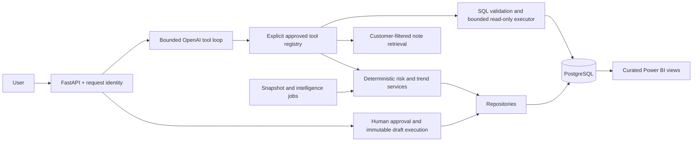

# Customer Intelligence Agent

A production-style portfolio application for customer-success teams: combine CRM facts, support metrics and qualitative notes to explain customer risk, detect deterioration, and propose human-approved follow-ups. All example customers and notes are synthetic.

## Planned architecture

The model interprets questions and synthesizes grounded explanations. Python owns customer facts, risk scores, historical deltas and action state. PostgreSQL stores customer data, snapshots, action audit records and intelligence events. OpenAI embeddings power semantic retrieval without a vector database; a clearly labeled offline mode supports local demonstrations and CI.

Implementation progress, acceptance criteria and validation evidence are tracked in [BUILD_PLAN.md](BUILD_PLAN.md). Persistent engineering conventions are in [AGENTS.md](AGENTS.md). Setup instructions and deployment runbooks will be completed alongside the tested implementation.
