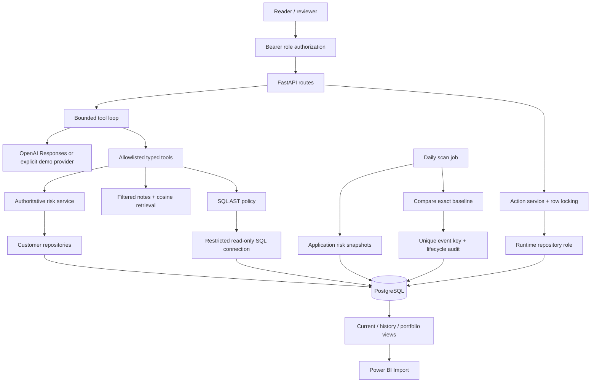
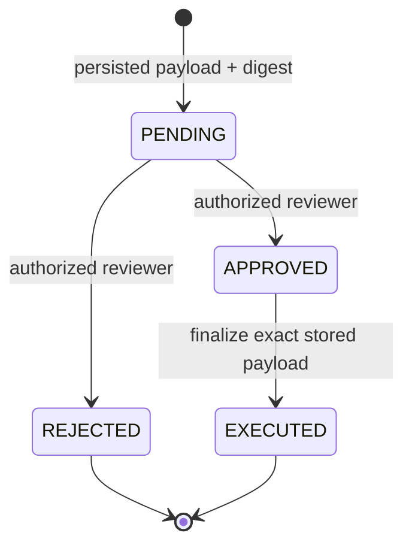

# Architecture, trust boundaries and decisions

## Business workflow

An account manager identifies which customers need attention, inspects deterministic risk, reads relevant qualitative evidence, proposes a follow-up and has a human reviewer finalize an internal draft. A daily job snapshots the portfolio and raises durable deterioration events. BI consumes a stable analytical contract rather than model-generated numbers.

## Module contracts

| Layer | Location | Responsibility |
|---|---|---|
| API/auth | `src/api.py`, `src/auth.py`, `src/routes/` | HTTP validation, role identity, error mapping, request ID |
| Agent | `src/agents/` | Provider protocol, strict schemas, bounded tool loop, SQL AST policy |
| Services | `src/services/` | Risk, narrative validation, action/event policies, trends |
| Persistence | `src/database.py`, `src/repositories/` | Parameterized queries, transactions, locks, upserts |
| Retrieval | `src/retrieval/` | Metadata, chunking, embedding cache and cosine search |
| Analytics | `src/analytics/` | Risk-rule reuse and snapshot contract |
| Operations | `src/observability/`, `scripts/` | Safe JSON logs, counters, migrations, jobs, smoke tests |
| Evaluation | `evals/datasets/`, `evals/run_evals.py` | Independent cases, thresholds and machine-readable results |

The application factory and lazy runtime let deterministic endpoints start without contacting any model provider. Model clients are injected behind a small protocol and mocked in tests. Tool dispatch looks up a fixed registry; `getattr`, `eval`, `exec` and arbitrary Python are never used for model instructions.

## Authoritative facts and grounded narratives

Customer identity, Decimal MRR, NPS, support counts, risk scores, date windows, risk delta and state transitions are computed/read deterministically. `/agent/ask` renders the returned tool data directly. `/insight` asks the provider only for qualitative fields. The service validates source membership and limits narrative quantities, then attaches authoritative risk fields itself. Evidence excerpts are original retrieved chunks, not LLM-written quotations.

Model-generated free prose has no guaranteed entailment proof. Source membership prevents fabricated citations but does not prove a sentence is supported. Recommendations are proposals and confidence is uncalibrated coverage. A live-model evaluation and human review are needed before consequential deployment.

## Database roles

| Principal | Rights |
|---|---|
| Schema owner / migration job | Versioned DDL, seeding, role provisioning; never exposed to API or model |
| `cia_app` | Read customer data; create/transition actions and events; append audits; write snapshots |
| `cia_analyst` | SELECT on customers and curated views, default read-only; no audit/payload access |
| `cia_bi` | NOLOGIN grouping role with SELECT on curated views; grant to a dedicated BI login |

Roles cannot create objects in `public`; `PUBLIC` temporary-object permission is revoked for this dedicated database. Runtime cannot update/delete audit records or change action payload fields. Owners can still alter data and schema: these controls defend application/model access, not a malicious database administrator. Roles are cluster-wide, so role-provisioning integration tests belong in a disposable cluster and use their own database.

## Transactional workflows

Action transitions lock the row, validate state and digest, update the artifact/state and insert the audit record in one transaction. PostgreSQL constraints/triggers provide a second integrity layer. Races cannot double-execute. The draft cannot be edited; replacement content must create a new proposal. Nothing is emailed or sent to another service.

Event inserts use `ON CONFLICT(dedupe_key) DO NOTHING`, enforced by a unique constraint. Event transitions similarly lock and audit rows. Key fields are immutable. A key identifies `(rule-version, customer, window, baseline-date, previous-score, current-score)`, excluding scan timestamps. Identical rescans do not reopen resolved events. A new daily baseline is a new comparison and can produce another event; this is not episode-based alert suppression.

## Analytics semantics

Snapshots use one repeatable-read transaction for input facts/action counts and output writes. `risk_model_version` records the source rule policy. Historical grain is customer/day; current snapshots refuse older-date overwrites. DAX never recalculates risk. Window baselines require an exact date and matching model version; missing days are visible as insufficient history rather than silently substituted.

MRR is CAD, dates are calendar dates, timestamps are timezone-aware UTC. NPS is a synthetic account-level proxy. `snapshot_timestamp` is refresh time, not a claim about source-system freshness. A backfill with current input cannot reconstruct old source values; only intentionally supplied historical observations support a real backfill.

## Operations and security limits

- Request IDs accept only bounded safe characters. Log fields are allowlisted; exception text, raw SQL, notes, model prompts, request headers and draft payloads are excluded.
- Metrics are lightweight JSON, not a global monitoring backend. Request/agent/tool/action counters are per process; scan totals are durable in PostgreSQL and current open-event count is queried live.
- RAG corpus/model hashes invalidate cache content. Caches use NumPy with pickle disabled. Local files are trusted deployment inputs, never public upload endpoints.
- Paid calls are bounded by argument size, output tokens, retries, timeout and tool-call count. Add per-user rate limits/API gateway quotas and budget alerts for an internet-facing service.
- Single-organization authorization uses reader/reviewer bearer keys. There is no tenant partitioning or personal reviewer identity. Staging requires explicit keys; local demo access must stay on loopback.
- Migrations are versioned and transactionally recorded under an advisory lock. Future schema changes must use new numbered files and expand/contract compatibility to preserve revision rollback.
- No schedule is started merely by importing Python. Azure scheduled jobs are explicit infrastructure assets; a local scheduler can run the same scan command.
- No UI application is required: Swagger/OpenAPI and the Power BI specification expose a reviewable workflow.

## Ten design decisions

1. **PostgreSQL as the sole store:** one auditable transaction boundary for facts, approvals, snapshots and events.
2. **Decimal money:** no floating-point accumulation errors in MRR.
3. **Injected business date:** reproducible risk/trend boundary tests and explicit demo time.
4. **Transparent risk rules:** stakeholders can inspect causes; avoids pretending to have a calibrated churn model.
5. **Direct approved tool loop:** understandable model capability boundary without an orchestration framework.
6. **Deterministic answer rendering:** authoritative numbers never pass through a model rewrite.
7. **Small SQL AST allowlist plus database controls:** syntax validation alone cannot authorize a database connection.
8. **Direct cosine retrieval:** adequate for a small corpus, with customer metadata filtering and inspectable math.
9. **Immutable proposals and atomic transitions:** approved content cannot drift and retries cannot duplicate execution.
10. **Shared risk logic with dated snapshots:** BI and proactive intelligence consume the same truth, with rule-version checks and explicit missing history.
